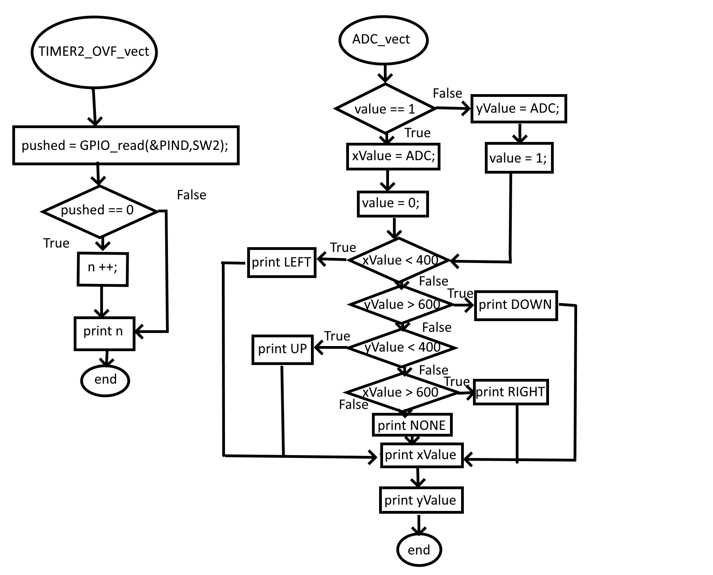

# Arduino Uno project

Application of analog joy-stick (2 ADC channels, 1 push button), rotary encoder, and Digilent PmodCLP LCD module.

### Team members

* Marek Černý
* Mikuláš Fyman

## Recommended GitHub repository structure

   ```c
   YOUR_PROJECT        // PlatfomIO project
   ├── include         // Included files
   │   └── timer.h
   ├── lib             // Libraries
   │   ├── gpio        // gpio library folder
   │   │   ├── gpio.c  
   │   │   └── gpio.h  
   │   └── lcd         // lcd library folder
   │        ├── lcd_definitions.h
   │        ├── lcd.c
   │        └── lcd.h
   ├── src             // Source file(s)
   │   └── main.c
   ├── test            // No need this
   ├── platformio.ini  // Project Configuration File
   └── README.md       // Report of this project
   ```

## Hardware description

### Arduino Uno

Arduino Uno is a microcontroller development board based on the ATmega328P. This board has 14 digital input/output pins (also 6 of them can be used as PWM), 6 analog input/output pins, 16MHz ceramic resonator, reset button, a power jack, an ICSP header and a USB connection.


### Analog joystick

Analog joystick is a module, which allows us to scan a motion of 2 directions (X, Y). This joystick is consisted of two potentiometers of 10k Ohm resistivity and push button. It communicates with controller by the change of voltage.


### Rotary encoder

A rotary encoder is a type of position sensor which is used for determining the angular position of a rotating shaft. It generates an electrical signal, either analog or digital, according to the rotational movement.


The outcome of rotary encoder are two square wave signals (A a B) mutually phased by 90 deg.


 If signals A and B have the same values, the rotation is clockwise. If the signals have different values, the rotation is counter clockwise.


### Digilent PmodCLP LCD module

The Pmod CLP is a 16x2 character LCD module. Users provide 8 bits of data in parallel to display a variety of characters (192 predefined characters including 93 ASCII characters) on the screen.


## Software description

| **Library name** | **Brief description** | **Usage in our code** |
   | :-: | :-: | :-: |
   | GPIO  | Allowing high performance digital pin access | Setting Input/Output of a pin and reading its values |
   | LCD   | Necessary functions for controlling the display | Initialization of module itself, writing values/strings on exact positions |
   | Timer | Hardware block within an MCU and can be used to measure time events | Determination of refresh time of display and code cycle, also allows us to interrupt |

   ### Source files & libraries

 1. **Timer:** [timer.h](https://github.com/marekcrn/digital-electronics-2/blob/main/labs/project/project/include/timer.h)
 2. **Gpio:** [gpio.c](https://github.com/marekcrn/digital-electronics-2/blob/main/labs/project/project/lib/gpio/gpio.c), [gpio.h](https://github.com/marekcrn/digital-electronics-2/blob/main/labs/project/project/lib/gpio/gpio.h)
 3. **LCD:** [lcd.c](https://github.com/marekcrn/digital-electronics-2/blob/main/labs/project/project/lib/lcd/lcd.c), [lcd.h](https://github.com/marekcrn/digital-electronics-2/blob/main/labs/project/project/lib/lcd/lcd.h), [lcd_definitions.h](https://github.com/marekcrn/digital-electronics-2/blob/main/labs/project/project/lib/lcd/lcd_definitions.h)
 4. **Source:** [main.c](https://github.com/marekcrn/digital-electronics-2/blob/main/labs/project/project/src/main.c)

## Flowcharts

### Enable both directions of Joystick


### Flowchart of Joystick



### Flowchart of Rotary Encoder


## Video

### JoyStick

[Joystick]()

### Rotary Encoder

[Encoder]()


## References

* [1. doc. Ing. Fryza Ph.D. DE2 - 2022 Labs](https://github.com/tomas-fryza/digital-electronics-2/tree/master/labs)
* [2. Joystick](https://navody.dratek.cz/navody-k-produktum/arduino-joystick-ps2.html)
* [3. Encoder](https://howtomechatronics.com/tutorials/arduino/rotary-encoder-works-use-arduino/?fbclid=IwAR1UxOQv36Y3HIfpMDaVhkYf1JpnIz0Ywbn_U0N9zagLQHEsaXvEKFfGdwQ)
* [4. Digilent official website](https://projects.digilentinc.com/products/pmod-clp)
* [5. Arduino Uno](https://docs.arduino.cc/retired/boards/arduino-uno-rev3-with-long-pins)
