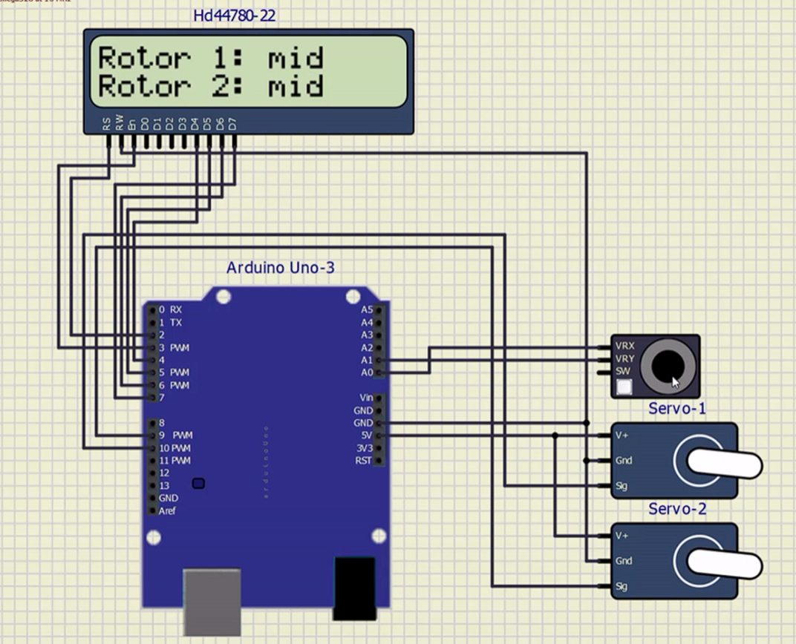

# Project 2

Precise generation of several PWM channels. Application of two (or more) Servo motors SG90.

## Instructions

The goal of the project is cooperation in pairs, further study of the topic, design of own solutions, implementation, creation of project documentation and presentation of results. The division of roles and tasks within the team is up to their members.

* Students work on a project in the labs during the 12th and 13th weeks of the semester.

* Through the BUT e-learning, students submit a link to the GitHub repository, which contains the complete project in PlatfomIO and a descriptive README file. The submission deadline is the day before the next laboratory, i.e. in 2 weeks.

* The source code for the AVR must be written in C and/or Assembly and must be implementable on Arduino Uno board using toolchains from the semester, ie PlatformIO and not in the Arduino-style. No other development tools are allowed.

## Recommended GitHub repository structure

   ```c
   YOUR_PROJECT        // PlatfomIO project
   ├── include         // Included files
   │   └── timer.h
   ├── lib             // Libraries
   │   ├── gpio        // gpio library folder
   │   │   ├── gpio.c  
   │   │   └── gpio.h  
   │   └── lcd         // lcd library folder
   │        ├── lcd_definitions.h
   │        ├── lcd.c
   │        └── lcd.h
   ├── src             // Source file(s)
   │   └── main.c
   ├── test            // No need this
   │   └── README.md   // Report of this project
   └── platformio.ini  // Project Configuration File
   ```

## Recommended README.md file structure

### Team members

* Marek Černý
* Mikuláš Fyman

## Hardware description

#### Arduino Uno
Arduino Uno je mikrokontrolérová vývojová deska fungující na čipu ATmega328 (Deska disponuje 6-ti analogovými vstupy, 14-ti digitálními I/O vstupy a 6 z nich se dá použít jako PWM výstup, 16 MHz krystalem, USB 2 typ B konektorem, napájecím konektorem a rozhraním ICSP . Vývojovou desku zle napájet pomocí USB portu nebo externím stejnosměrným zdrojem o napětí 6÷12 V. Maximální proud na jeden konektor pracující na napětí 5 V je 40 mA a 50 mA pro 3,3 V piny.


#### Servo
Servo je elektromagnetické zařízení, které podle hodnoty vstupního signálu, nejčastěji PWM, umožňuje otáčet hřídelí. Zjednodušeně se dá říci, že se jedná o motor, který umožňuje kontrolovat přesnou pozici hřídele. Servo očekává, že na vstupu dostane signál každých 20 ms. Pokud bude hodnota tohoto vstupního signálu korespondovat s aktuálním pootočením hřídele, tak ke změně pootočení nedochází a servo se snaží udržet na aktuální pozici. Délka samotného signálu (nejčastěji PWM) určuje, jak moc se hřídel pootočí. 


#### Joystick
Analogový joystick je modul, který nám umožňuje snímat pohyb ve 2 směrech (X, Y). Tento joystick se skládá ze dvou potenciometrů s odporem 10k Ohm a tlačítka. S vývojovou deskou komunikuje pomocí změny napětí.


#### Schéma zapojení v simulide



## Software description

### Source files & libraries

1. **Timer:** [timer.h](https://github.com/marekcrn/digital-electronics-2/blob/main/labs/projekt2/projekt2/include/timer.h)
2. **Gpio:** [gpio.c](https://github.com/marekcrn/digital-electronics-2/blob/main/labs/projekt2/projekt2/lib/gpio/gpio.c), [gpio.h](https://github.com/marekcrn/digital-electronics-2/blob/main/labs/projekt2/projekt2/lib/gpio/gpio.h)
3. **LCD:** [lcd.c](https://github.com/marekcrn/digital-electronics-2/blob/main/labs/projekt2/projekt2/lib/lcd/lcd.c), [lcd.h](https://github.com/marekcrn/digital-electronics-2/blob/main/labs/projekt2/projekt2/lib/lcd/lcd.h), [lcd_definitions.h](https://github.com/marekcrn/digital-electronics-2/blob/main/labs/projekt2/projekt2/lib/lcd/lcd_definitions.h)
4. **Source:** [main.c](https://github.com/marekcrn/digital-electronics-2/blob/main/labs/projekt2/projekt2/src/main.c)

## Video
https://youtu.be/4VQnRvzJcvU

## References

1. https://docs.arduino.cc/resources/datasheets/A000066-datasheet.pdf
2. https://navody.dratek.cz/arduino-projekty/servo-motor.html
3. https://www.ee-diary.com/2021/07/phase-correct-pwm-with-atmega328p.html?fbclid=IwAR24t4myL5OQH8FrCGZd9OGGwccg384H3I16n2MI2PBwJB_tLiVsiZRMhus
4. https://ww1.microchip.com/downloads/en/DeviceDoc/Atmel-7810-Automotive-Microcontrollers-ATmega328P_Datasheet.pdf
